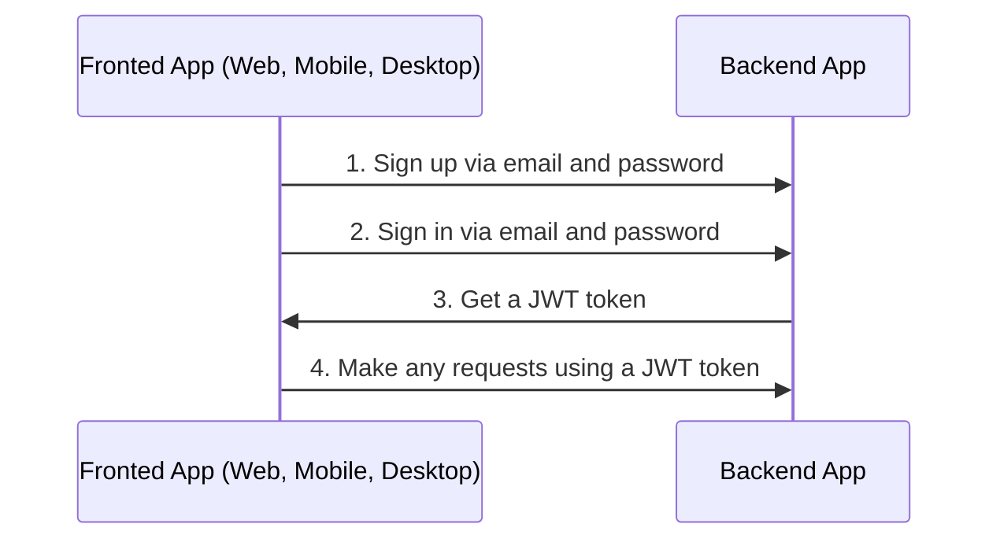
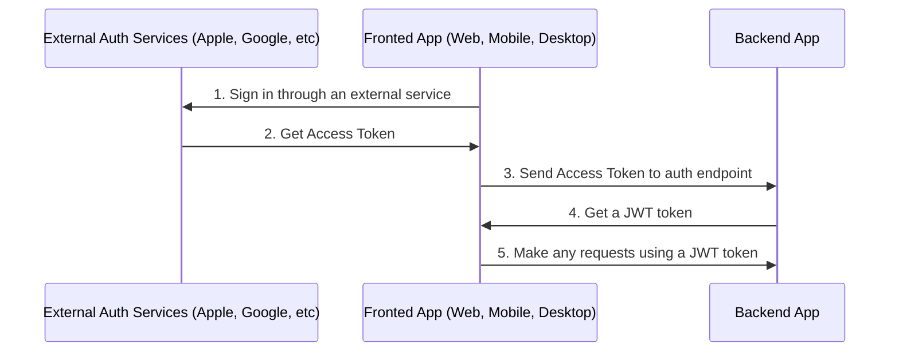

# Auth

> ## ⚠️ Ajustes deste projeto (2026-08-07) — leia antes do restante
>
> Este documento vem do boilerplate original. Quatro coisas divergem aqui, e o que
> está escrito neste bloco prevalece sobre o resto do arquivo.
>
> **1. Login social está DESABILITADO.** O projeto trabalha só com e-mail + senha.
> As seções [Auth via Apple](#auth-via-apple), [Auth via Facebook](#auth-via-facebook)
> e [Auth via Google](#auth-via-google) descrevem código que **continua no
> repositório mas não está registrado**: `AuthGoogleModule` e `googleConfig` foram
> retirados das listas `imports`/`load` do `src/app.module.ts`. Nenhuma rota
> `/api/v1/auth/{google,facebook,apple}/*` responde — todas dão 404.
>
> **Como reativar** (se um dia for preciso): devolver ao `src/app.module.ts` o
> `import googleConfig from './core/auth-google/config/google.config'`, o
> `import { AuthGoogleModule }`, e incluí-los em `load` e `imports`.
> ⚠️ **Antes de reativar, leia**: o OAuth cria `User` por fora do
> `UsersService.create()`, e todo `User` neste projeto precisa ter um `Author` 1:1
> (ver abaixo). Reativar sem fazer o fluxo OAuth criar o `Author` na mesma
> transação fura o invariante silenciosamente.
>
> **2. Registro público está DESABILITADO.** `POST /api/v1/auth/email/register`
> **não existe mais** (404). Este é um painel administrativo: o primeiro admin vem
> do seed e os demais usuários são criados por
> `POST /api/v1/users` (admin-only). O passo "1. Sign up via email and password"
> do diagrama abaixo não se aplica.
>
> **3. Todo `User` tem um `Author` 1:1.** Criar usuário cria o perfil editorial na
> **mesma transação** — se o `Author` falhar, o `User` não é criado. Deletar
> usuário faz soft delete dos dois. Não há rota para criar ou apagar `Author`
> avulso. `GET /api/v1/auth/me` devolve o `author` junto.
>
> **4. Autenticação é por Bearer token no header — não por cookie.** O board
> original pedia "JWT em cookies"; foi revertido porque front e API ficam em
> **sites diferentes**, cenário em que o cookie da API é cookie de terceiros
> (bloqueado por padrão no Safari, particionado no Firefox). O fluxo de token
> descrito em [Refresh token flow](#refresh-token-flow) continua valendo
> integralmente.
>
> Contrato completo das rotas para o frontend: **`INTEGRACAO-AUTH-AUTHORS.md`**,
> na raiz do repositório.

## Table of Contents <!-- omit in toc -->

- [General info](#general-info)
  - [Auth via email flow](#auth-via-email-flow)
  - [Auth via external services or social networks flow](#auth-via-external-services-or-social-networks-flow)
- [Configure Auth](#configure-auth)
- [Auth via Apple](#auth-via-apple)
- [Auth via Facebook](#auth-via-facebook)
- [Auth via Google](#auth-via-google)
- [About JWT strategy](#about-jwt-strategy)
- [Refresh token flow](#refresh-token-flow)
  - [Video example](#video-example)
  - [Support login for multiple devices / Sessions](#support-login-for-multiple-devices--sessions)
- [Logout](#logout)
- [Q\&A](#qa)
  - [After `POST /api/v1/auth/logout` or removing session from the database, the user can still make requests with an `access token` for some time. Why?](#after-post-apiv1authlogout-or-removing-session-from-the-database-the-user-can-still-make-requests-with-an-access-token-for-some-time-why)

---

## General info

### Auth via email flow

By default boilerplate used sign in and sign up via email and password.



<https://user-images.githubusercontent.com/6001723/224566194-1c1f4e98-5691-4703-b30e-92f99ec5d929.mp4>

### Auth via external services or social networks flow

Also you can sign up via another external services or social networks like Apple, Facebook and Google.



For auth with external services or social networks you need:

1. Sign in through an external service and get access token(s).
1. Call one of endpoints with access token received in frontend app on 1-st step and get JWT token from the backend app.

   ```text
   POST /api/v1/auth/facebook/login

   POST /api/v1/auth/google/login

   POST /api/v1/auth/apple/login
   ```

1. Make any requests using a JWT token

---

## Configure Auth

1. Generate secret keys for `access token` and `refresh token`:

   ```bash
   node -e "console.log('\nAUTH_JWT_SECRET=' + require('crypto').randomBytes(256).toString('base64') + '\n\nAUTH_REFRESH_SECRET=' + require('crypto').randomBytes(256).toString('base64') + '\n\nAUTH_FORGOT_SECRET=' + require('crypto').randomBytes(256).toString('base64') + '\n\nAUTH_CONFIRM_EMAIL_SECRET=' + require('crypto').randomBytes(256).toString('base64'));"
   ```

1. Go to `/.env` and replace `AUTH_JWT_SECRET` and `AUTH_REFRESH_SECRET` with output from step 1.

   ```text
   AUTH_JWT_SECRET=HERE_SECRET_KEY_FROM_STEP_1
   AUTH_REFRESH_SECRET=HERE_SECRET_KEY_FROM_STEP_1
   ```

## Auth via Apple

> ⚠️ **Desabilitado neste projeto** — ver o bloco no topo. As instruções abaixo só
> valem depois de reativar o módulo social.

1. [Set up your service on Apple](https://www.npmjs.com/package/apple-signin-auth)
1. Change `APPLE_APP_AUDIENCE` in `.env`

   ```text
   APPLE_APP_AUDIENCE=["com.company", "com.company.web"]
   ```

## Auth via Facebook

> ⚠️ **Desabilitado neste projeto** — ver o bloco no topo.

1. Go to https://developers.facebook.com/apps/creation/ and create a new app
   

   
2. Go to `Settings` -> `Basic` and get `App ID` and `App Secret` from your app
   
3. Change `FACEBOOK_APP_ID` and `FACEBOOK_APP_SECRET` in `.env`

   ```text
   FACEBOOK_APP_ID=123
   FACEBOOK_APP_SECRET=abc
   ```

## Auth via Google

> ⚠️ **Desabilitado neste projeto** — `AuthGoogleModule` está desregistrado do
> `src/app.module.ts`. Ver o bloco no topo, incluindo a ressalva sobre o `Author`
> 1:1 antes de reativar.

1. You need a `CLIENT_ID`, `CLIENT_SECRET`. You can find these pieces of information by going to the [Developer Console](https://console.cloud.google.com/), clicking your project (if doesn't have create it here https://console.cloud.google.com/projectcreate) -> `APIs & services` -> `credentials`.
1. Change `GOOGLE_CLIENT_ID` and `GOOGLE_CLIENT_SECRET` in `.env`

   ```text
   GOOGLE_CLIENT_ID=abc
   GOOGLE_CLIENT_SECRET=abc
   ```

## About JWT strategy

In the `validate` method of the `src/auth/strategies/jwt.strategy.ts` file, you can see that we do not check if the user exists in the database because it is redundant, it may lose the benefits of the JWT approach and can affect the application performance.

To better understand how JWT works, watch the video explanation https://www.youtube.com/watch?v=Y2H3DXDeS3Q and read this article https://jwt.io/introduction/

```typescript
// src/auth/strategies/jwt.strategy.ts

@Injectable()
export class JwtStrategy extends PassportStrategy(Strategy, 'jwt') {
  // ...

  public validate(payload) {
    if (!payload.id) {
      throw new UnauthorizedException();
    }

    return payload;
  }
}
```

> If you need to get full user information, get it in services.

## Refresh token flow

1. On sign in (`POST /api/v1/auth/email/login`) you will receive `token`, `tokenExpires` and `refreshToken` in response.
1. On each regular request you need to send `token` in `Authorization` header.
1. If `token` is expired (check with `tokenExpires` property on client app) you need to send `refreshToken` to `POST /api/v1/auth/refresh` in `Authorization` header to refresh `token`. You will receive new `token`, `tokenExpires` and `refreshToken` in response.

### Video example

https://github.com/brocoders/nestjs-boilerplate/assets/6001723/f6fdcc89-5ec6-472b-a6fc-d24178ad1bbb

### Support login for multiple devices / Sessions

Boilerplate supports login for multiple devices with a Refresh Token flow. This is possible due to `sessions`. When a user logs in, a new session is created and stored in the database. The session record contains `sessionId (id)`, `userId`, and `hash`.

On each `POST /api/v1/auth/refresh` request we check `hash` from the database with `hash` from the Refresh Token. If they are equal, we return new `token`, `tokenExpires`, and `refreshToken`. Then we update `hash` in the database to disallow the use of the previous Refresh Token.

## Logout

1. Call following endpoint:

   ```text
   POST /api/v1/auth/logout
   ```

2. Remove `access token` and `refresh token` from your client app (cookies, localStorage, etc).

## Q&A

### After `POST /api/v1/auth/logout` or removing session from the database, the user can still make requests with an `access token` for some time. Why?

It's because we use `JWT`. `JWTs` are stateless, so we can't revoke them, but don't worry, this is the correct behavior and the access token will expire after the time specified in `AUTH_JWT_TOKEN_EXPIRES_IN` (the default value is 15 minutes). If you still need to revoke `JWT` tokens immediately, you can check if a session exists in [jwt.strategy.ts](https://github.com/brocoders/nestjs-boilerplate/blob/2896589f52d2df025f12069ba82ba4fac1db8ebd/src/auth/strategies/jwt.strategy.ts#L20-L26) on each request. However, it's not recommended because it can affect the application's performance.

---

Previous: [Database](database.md)

Next: [Serialization](serialization.md)
