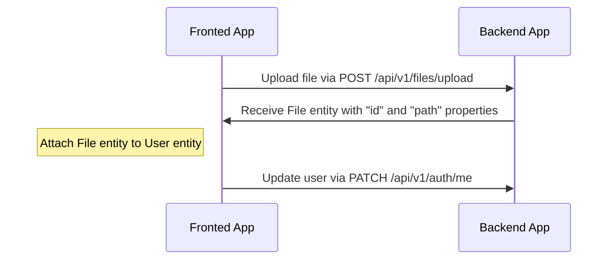
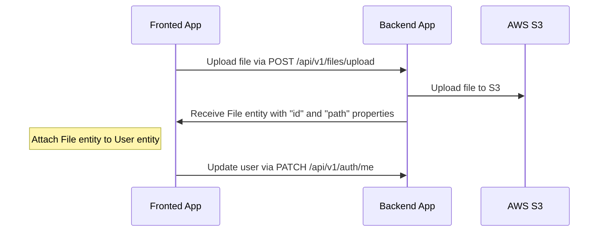
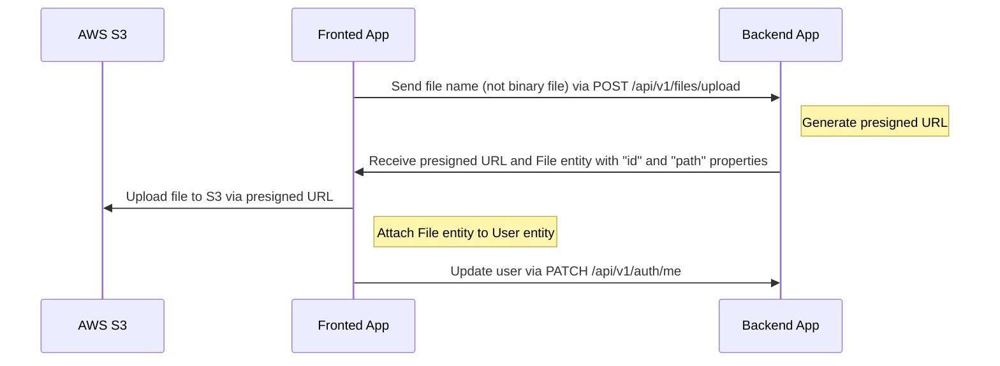

# File uploading

---

## Table of Contents <!-- omit in toc -->

- [Drivers support](#drivers-support)
- [Authentication and upload limits](#authentication-and-upload-limits)
- [Uploading and attach file flow for `local` driver](#uploading-and-attach-file-flow-for-local-driver)
  - [An example of uploading an avatar to a user profile (local)](#an-example-of-uploading-an-avatar-to-a-user-profile-local)
  - [Video example](#video-example)
- [Uploading and attach file flow for `s3` driver](#uploading-and-attach-file-flow-for-s3-driver)
  - [Configuration for `s3` driver](#configuration-for-s3-driver)
  - [An example of uploading an avatar to a user profile (S3)](#an-example-of-uploading-an-avatar-to-a-user-profile-s3)
- [Uploading and attach file flow for `s3-presigned` driver](#uploading-and-attach-file-flow-for-s3-presigned-driver)
  - [Configuration for `s3-presigned` driver](#configuration-for-s3-presigned-driver)
  - [An example of uploading an avatar to a user profile (S3 Presigned URL)](#an-example-of-uploading-an-avatar-to-a-user-profile-s3-presigned-url)
- [How to delete files?](#how-to-delete-files)

---

## Drivers support

Out-of-box boilerplate supports the following drivers: `local`, `s3`, and `s3-presigned`. You can set it in the `.env` file, variable `FILE_DRIVER`. If you want to use another service for storing files, you can extend it.

> For production we recommend using the "s3-presigned" driver to offload your server.

> ⚠️ `FILE_DRIVER` is read once, when `src/infra/files/files.module.ts` is loaded, to decide which uploader module gets wired in. Changing it in `.env` only takes effect after the API is restarted — it is not hot-swappable. See [Installing and Running](installing-and-running.md#switching-file_driver).

In this project, the `s3` and `s3-presigned` drivers target an S3-compatible storage: a local **MinIO** container in development, and a **DigitalOcean Space** in production — there's no raw AWS S3 involved. Switching between the two is only a matter of environment variables (`AWS_S3_ENDPOINT`, `AWS_S3_FORCE_PATH_STYLE`, `AWS_S3_PUBLIC_URL`, region and credentials); no code changes are required. See [Installing and Running](installing-and-running.md#local-docker-environment-for-this-project) for how to start MinIO locally, and `.specs/tasks-parte-2.md` ("Anexo — Produção: DigitalOcean Spaces") for the production provisioning checklist.

---

## Authentication and upload limits

- `POST /api/v1/files/upload` requires a valid JWT access token for every driver (`@UseGuards(AuthGuard('jwt'))`). Log in first (e.g. `POST /api/v1/auth/email/login`) and send the token as `Authorization: Bearer <token>`. If you don't have a user yet, run `npm run seed:run:relational` to create the seed users (see [src/infra/database/seeds/relational](../src/infra/database/seeds/relational)).
- Only `jpg`, `jpeg`, `png` and `gif` files are accepted — anything else is rejected by the upload filter.
- The maximum file size is 5 MB (`maxFileSize` in [src/infra/files/config/file.config.ts](../src/infra/files/config/file.config.ts)).

---

## Uploading and attach file flow for `local` driver

Endpoint `/api/v1/files/upload` is used for uploading files, which returns `File` entity with `id` and `path`. After receiving `File` entity you can attach this to another entity.

### An example of uploading an avatar to a user profile (local)



### Video example

<https://user-images.githubusercontent.com/6001723/224558636-d22480e4-f70a-4789-b6fc-6ea343685dc7.mp4>

## Uploading and attach file flow for `s3` driver

Endpoint `/api/v1/files/upload` is used for uploading files, which returns `File` entity with `id` and `path`. After receiving `File` entity you can attach this to another entity.

### Configuration for `s3` driver

This project's S3-compatible storage is a local **MinIO** container in development and a **DigitalOcean Space** in production — not raw AWS S3. See [Installing and Running](installing-and-running.md#local-docker-environment-for-this-project) for how to start MinIO, and `.specs/tasks-parte-2.md` ("Anexo — Produção: DigitalOcean Spaces") for the production provisioning checklist.

1. Development: `docker compose up -d --build` (full stack) or `docker compose -f docker-compose-dev.yaml up -d` (isolated dependencies) already start MinIO and create the bucket automatically via the `minio-init` sidecar — no manual bucket setup is needed.
1. Production: create the Space and generate a pair of Spaces access keys from the DigitalOcean panel (see the checklist referenced above).
1. Update `.env` (or your deployment's environment) with:

    ```dotenv
    FILE_DRIVER=s3
    ACCESS_KEY_ID=YOUR_ACCESS_KEY_ID
    SECRET_ACCESS_KEY=YOUR_SECRET_ACCESS_KEY
    AWS_S3_REGION=YOUR_AWS_S3_REGION
    AWS_DEFAULT_S3_BUCKET=YOUR_AWS_DEFAULT_S3_BUCKET
    AWS_S3_ENDPOINT=YOUR_S3_ENDPOINT       # http://minio:9000 (dev, API in Docker) / http://localhost:9000 (dev, API on host) / https://<region>.digitaloceanspaces.com (production)
    AWS_S3_FORCE_PATH_STYLE=true           # true for MinIO, false for DigitalOcean Spaces
    AWS_S3_PUBLIC_URL=YOUR_PUBLIC_BASE_URL # e.g. http://localhost:9000/<bucket> in dev; see env-example-relational for the production formats
    ```

    See `env-example-relational` for a full explanation of `AWS_S3_ENDPOINT`, `AWS_S3_FORCE_PATH_STYLE` and `AWS_S3_PUBLIC_URL` — including why the endpoint host differs between the two Docker Compose profiles in dev.
1. Restart the API (the driver is not hot-swappable — see the note under [Drivers support](#drivers-support)).

The `s3` driver doesn't require CORS on the bucket, since the file is uploaded through the backend, not the browser — CORS only matters for the `s3-presigned` driver below.

### An example of uploading an avatar to a user profile (S3)



## Uploading and attach file flow for `s3-presigned` driver

Endpoint `/api/v1/files/upload` is used for uploading files. In this case `/api/v1/files/upload` receives only `fileName` property (without binary file), and returns the `presigned URL` and `File` entity with `id` and `path`. After receiving the `presigned URL` and `File` entity you need to upload your file to the `presigned URL` and after that attach `File` to another entity.

### Configuration for `s3-presigned` driver

Same storage target as the `s3` driver above (MinIO in dev, DigitalOcean Spaces in production). The difference is that here the **browser** uploads the file directly to the bucket via a presigned URL, so the bucket itself — not the API — must allow the frontend's origin. This is a hard requirement for this driver, not an optional hardening step:

- **MinIO** (dev): configure CORS on the bucket with the `mc` client (the same client used by the `minio-init` sidecar that creates the bucket). Check `mc cors --help` for the exact subcommand/format available in your MinIO/`mc` version, since this has changed across releases.
- **DigitalOcean Spaces** (production): configure CORS from the Spaces panel (bucket → Settings → CORS Configurations).

Whichever way you configure it, the policy needs to express the same thing. For testing, start from a permissive configuration:

```json
[
  {
    "AllowedHeaders": ["*"],
    "AllowedMethods": ["GET", "PUT"],
    "AllowedOrigins": ["*"],
    "ExposeHeaders": []
  }
]
```

For production we recommend a stricter configuration, allowing `PUT` only from your frontend's real domain:

```json
[
  {
    "AllowedHeaders": ["*"],
    "AllowedMethods": ["PUT"],
    "AllowedOrigins": ["https://your-domain.com"],
    "ExposeHeaders": []
  },
  {
    "AllowedHeaders": ["*"],
    "AllowedMethods": ["GET"],
    "AllowedOrigins": ["*"],
    "ExposeHeaders": []
  }
]
```

Update `.env` (or your deployment's environment) with:

```dotenv
FILE_DRIVER=s3-presigned
ACCESS_KEY_ID=YOUR_ACCESS_KEY_ID
SECRET_ACCESS_KEY=YOUR_SECRET_ACCESS_KEY
AWS_S3_REGION=YOUR_AWS_S3_REGION
AWS_DEFAULT_S3_BUCKET=YOUR_AWS_DEFAULT_S3_BUCKET
AWS_S3_ENDPOINT=YOUR_S3_ENDPOINT       # http://minio:9000 (dev, API in Docker) / http://localhost:9000 (dev, API on host) / https://<region>.digitaloceanspaces.com (production)
AWS_S3_FORCE_PATH_STYLE=true           # true for MinIO, false for DigitalOcean Spaces
AWS_S3_PUBLIC_URL=YOUR_PUBLIC_BASE_URL # e.g. http://localhost:9000/<bucket> in dev; see env-example-relational for the production formats
```

See `env-example-relational` for a full explanation of `AWS_S3_ENDPOINT`, `AWS_S3_FORCE_PATH_STYLE` and `AWS_S3_PUBLIC_URL`. Restart the API after changing `FILE_DRIVER` (see the note under [Drivers support](#drivers-support) — the driver is not hot-swappable).

### An example of uploading an avatar to a user profile (S3 Presigned URL)



## How to delete files?

We prefer not to delete files, as this may have negative experience during restoring data. Also for this reason we also use [Soft-Delete](https://orkhan.gitbook.io/typeorm/docs/delete-query-builder#soft-delete) approach in database. However, if you need to delete files you can create your own handler, cronjob, etc.

---

Previous: [Serialization](serialization.md)

Next: [Tests](tests.md)
