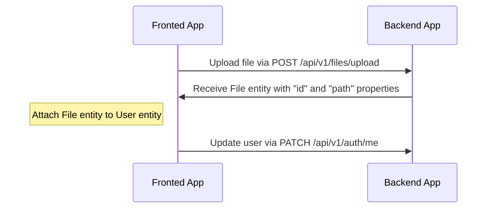
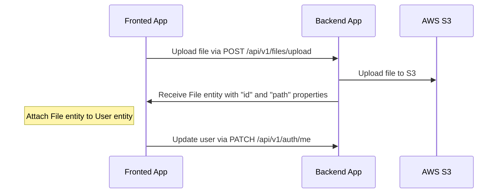
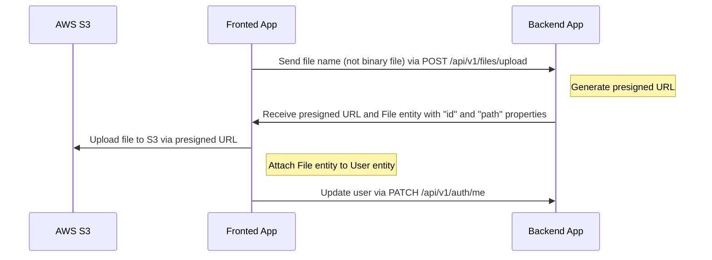

# File uploading

---

## Table of Contents <!-- omit in toc -->

- [Drivers support](#drivers-support)
- [Authentication and upload limits](#authentication-and-upload-limits)
- [File metadata](#file-metadata)
- [The media library CRUD (driver-agnostic)](#the-media-library-crud-driver-agnostic)
- [Uploading and attach file flow for `local` driver](#uploading-and-attach-file-flow-for-local-driver)
  - [An example of uploading an avatar to a user profile (local)](#an-example-of-uploading-an-avatar-to-a-user-profile-local)
  - [Video example](#video-example)
- [Uploading and attach file flow for `s3` driver](#uploading-and-attach-file-flow-for-s3-driver)
  - [Configuration for `s3` driver](#configuration-for-s3-driver)
  - [An example of uploading an avatar to a user profile (S3)](#an-example-of-uploading-an-avatar-to-a-user-profile-s3)
- [Uploading and attach file flow for `s3-presigned` driver](#uploading-and-attach-file-flow-for-s3-presigned-driver)
  - [Configuration for `s3-presigned` driver](#configuration-for-s3-presigned-driver)
  - [An example of uploading an avatar to a user profile (S3 Presigned URL)](#an-example-of-uploading-an-avatar-to-a-user-profile-s3-presigned-url)
- [How to delete files?](#how-to-delete-files)

---

## Drivers support

Out-of-box boilerplate supports the following drivers: `local`, `s3`, and `s3-presigned`. You can set it in the `.env` file, variable `FILE_DRIVER`. If you want to use another service for storing files, you can extend it.

> For production we recommend using the "s3-presigned" driver to offload your server.

> ⚠️ `FILE_DRIVER` is read once, when `src/infra/files/files.module.ts` is loaded, to decide which uploader module gets wired in. Changing it in `.env` only takes effect after the API is restarted — it is not hot-swappable. See [Installing and Running](installing-and-running.md#switching-file_driver).

In this project, the `s3` and `s3-presigned` drivers target an S3-compatible storage: a local **MinIO** container in development, and a **DigitalOcean Space** in production — there's no raw AWS S3 involved. Switching between the two is only a matter of environment variables (`AWS_S3_ENDPOINT`, `AWS_S3_FORCE_PATH_STYLE`, `AWS_S3_PUBLIC_URL`, region and credentials); no code changes are required. See [Installing and Running](installing-and-running.md#local-docker-environment-for-this-project) for how to start MinIO locally, and `.specs/tasks-parte-2.md` ("Anexo — Produção: DigitalOcean Spaces") for the production provisioning checklist.

---

## Authentication and upload limits

- `POST /api/v1/files/upload` requires a valid JWT access token for every driver (`@UseGuards(AuthGuard('jwt'))`). Log in first (e.g. `POST /api/v1/auth/email/login`) and send the token as `Authorization: Bearer <token>`. If you don't have a user yet, run `npm run seed:run:relational` to create the seed users (see [src/infra/database/seeds/relational](../src/infra/database/seeds/relational)).
- Only `jpg`, `jpeg`, `png` and `gif` files are accepted — anything else is rejected by the upload filter.
- The maximum file size is 5 MB (`maxFileSize` in [src/infra/files/config/file.config.ts](../src/infra/files/config/file.config.ts)).
- The upload accepts two **optional** extra fields besides the binary: `width` and `height` (integers). For the `local`/`s3` drivers they are `multipart/form-data` text fields; for `s3-presigned` they go in the JSON body. See [File metadata](#file-metadata) for why they come from the client.

---

## File metadata

Since Part 5 the `file` table is a real media library, not just `{ id, path }`. Every upload records:

| Field | Filled by | Notes |
| --- | --- | --- |
| `path` | driver | Object key (`s3`/`s3-presigned`) or serving route (`local`). Serialized as a ready-to-use public URL — see [Serialization](serialization.md). |
| `originalName` | server | Name of the file as sent. The stored key is random, so without this the library is unreadable. |
| `mimeType` | server | Detected on upload. In `s3-presigned` the API never sees the bytes, so it is derived from the extension. |
| `sizeBytes` | server | **A number**, not a formatted string. `1468006`, never `"1.4 MB"` — formatting is presentation. |
| `width` / `height` | **client** | Optional. Extracting them would require reading the binary, which the API only has in the `local` driver — `multer-s3` streams straight to the bucket and the presigned flow bypasses the API entirely. Accepting them declared is the only option that behaves the same across all three drivers, with no new dependency. |
| `uploadedBy` | server (token) | The `Author` of the authenticated user. Never accepted in the payload. |
| `title` / `alt` | client, later | The only editable fields — set via `PATCH /api/v1/files/:id`, not at upload time. |

`type` (`image` / `video` / `document`) is **derived from `mimeType` at serialization time and is not a column**. Files uploaded before Part 5 have no `mimeType` and therefore report `type: null`.

---

## The media library CRUD (driver-agnostic)

Only the **upload** talks to the storage, so only the upload is driver-specific. Listing, reading, editing metadata and deleting operate on the `file` table and live in a single controller, [src/infra/files/files.controller.ts](../src/infra/files/files.controller.ts), registered by `FilesModule` regardless of `FILE_DRIVER`:

| Method | Route | Auth | Notes |
| --- | --- | --- | --- |
| `GET` | `/api/v1/files` | JWT | Paginated, `createdAt DESC`. Filters: `type`, `q`. |
| `GET` | `/api/v1/files/:id` | JWT | `:id` must be a uuid — anything else is `400`. |
| `PATCH` | `/api/v1/files/:id` | JWT | Accepts only `title` and `alt`. Any derived field in the payload is refused with `422 { errors: { field: "readOnlyField" } }`. |
| `DELETE` | `/api/v1/files/:id` | JWT | Deletes the record **and** the stored object. |

> ⚠️ **Route change in the `local` driver.** Serving the binary from disk moved from `GET /api/v1/files/:path` to `GET /api/v1/files/download/:path`, because the old shape collided with the new `GET /api/v1/files/:id` (both are single-segment wildcards, so whichever controller registered first swallowed the other). The Part 5 migration rewrites the `path` values already stored, so existing uploads keep working. The `s3` drivers are unaffected — they store a bare object key.

---

## Uploading and attach file flow for `local` driver

Endpoint `/api/v1/files/upload` is used for uploading files, which returns `File` entity with `id` and `path`. After receiving `File` entity you can attach this to another entity.

### An example of uploading an avatar to a user profile (local)



### Video example

<https://user-images.githubusercontent.com/6001723/224558636-d22480e4-f70a-4789-b6fc-6ea343685dc7.mp4>

## Uploading and attach file flow for `s3` driver

Endpoint `/api/v1/files/upload` is used for uploading files, which returns `File` entity with `id` and `path`. After receiving `File` entity you can attach this to another entity.

### Configuration for `s3` driver

This project's S3-compatible storage is a local **MinIO** container in development and a **DigitalOcean Space** in production — not raw AWS S3. See [Installing and Running](installing-and-running.md#local-docker-environment-for-this-project) for how to start MinIO, and `.specs/tasks-parte-2.md` ("Anexo — Produção: DigitalOcean Spaces") for the production provisioning checklist.

1. Development: `docker compose up -d --build` (full stack) or `docker compose -f docker-compose-dev.yaml up -d` (isolated dependencies) already start MinIO and create the bucket automatically via the `minio-init` sidecar — no manual bucket setup is needed.
1. Production: create the Space and generate a pair of Spaces access keys from the DigitalOcean panel (see the checklist referenced above).
1. Update `.env` (or your deployment's environment) with:

    ```dotenv
    FILE_DRIVER=s3
    ACCESS_KEY_ID=YOUR_ACCESS_KEY_ID
    SECRET_ACCESS_KEY=YOUR_SECRET_ACCESS_KEY
    AWS_S3_REGION=YOUR_AWS_S3_REGION
    AWS_DEFAULT_S3_BUCKET=YOUR_AWS_DEFAULT_S3_BUCKET
    AWS_S3_ENDPOINT=YOUR_S3_ENDPOINT       # http://minio:9000 (dev, API in Docker) / http://localhost:9000 (dev, API on host) / https://<region>.digitaloceanspaces.com (production)
    AWS_S3_FORCE_PATH_STYLE=true           # true for MinIO, false for DigitalOcean Spaces
    AWS_S3_PUBLIC_URL=YOUR_PUBLIC_BASE_URL # e.g. http://localhost:9000/<bucket> in dev; see env-example-relational for the production formats
    ```

    See `env-example-relational` for a full explanation of `AWS_S3_ENDPOINT`, `AWS_S3_FORCE_PATH_STYLE` and `AWS_S3_PUBLIC_URL` — including why the endpoint host differs between the two Docker Compose profiles in dev.
1. Restart the API (the driver is not hot-swappable — see the note under [Drivers support](#drivers-support)).

The `s3` driver doesn't require CORS on the bucket, since the file is uploaded through the backend, not the browser — CORS only matters for the `s3-presigned` driver below.

### An example of uploading an avatar to a user profile (S3)



## Uploading and attach file flow for `s3-presigned` driver

Endpoint `/api/v1/files/upload` is used for uploading files. In this case `/api/v1/files/upload` receives only `fileName` property (without binary file), and returns the `presigned URL` and `File` entity with `id` and `path`. After receiving the `presigned URL` and `File` entity you need to upload your file to the `presigned URL` and after that attach `File` to another entity.

### Configuration for `s3-presigned` driver

Same storage target as the `s3` driver above (MinIO in dev, DigitalOcean Spaces in production). The difference is that here the **browser** uploads the file directly to the bucket via a presigned URL, so the bucket itself — not the API — must allow the frontend's origin. This is a hard requirement for this driver, not an optional hardening step:

- **MinIO** (dev): configure CORS on the bucket with the `mc` client (the same client used by the `minio-init` sidecar that creates the bucket). Check `mc cors --help` for the exact subcommand/format available in your MinIO/`mc` version, since this has changed across releases.
- **DigitalOcean Spaces** (production): configure CORS from the Spaces panel (bucket → Settings → CORS Configurations).

Whichever way you configure it, the policy needs to express the same thing. For testing, start from a permissive configuration:

```json
[
  {
    "AllowedHeaders": ["*"],
    "AllowedMethods": ["GET", "PUT"],
    "AllowedOrigins": ["*"],
    "ExposeHeaders": []
  }
]
```

For production we recommend a stricter configuration, allowing `PUT` only from your frontend's real domain:

```json
[
  {
    "AllowedHeaders": ["*"],
    "AllowedMethods": ["PUT"],
    "AllowedOrigins": ["https://your-domain.com"],
    "ExposeHeaders": []
  },
  {
    "AllowedHeaders": ["*"],
    "AllowedMethods": ["GET"],
    "AllowedOrigins": ["*"],
    "ExposeHeaders": []
  }
]
```

Update `.env` (or your deployment's environment) with:

```dotenv
FILE_DRIVER=s3-presigned
ACCESS_KEY_ID=YOUR_ACCESS_KEY_ID
SECRET_ACCESS_KEY=YOUR_SECRET_ACCESS_KEY
AWS_S3_REGION=YOUR_AWS_S3_REGION
AWS_DEFAULT_S3_BUCKET=YOUR_AWS_DEFAULT_S3_BUCKET
AWS_S3_ENDPOINT=YOUR_S3_ENDPOINT       # http://minio:9000 (dev, API in Docker) / http://localhost:9000 (dev, API on host) / https://<region>.digitaloceanspaces.com (production)
AWS_S3_FORCE_PATH_STYLE=true           # true for MinIO, false for DigitalOcean Spaces
AWS_S3_PUBLIC_URL=YOUR_PUBLIC_BASE_URL # e.g. http://localhost:9000/<bucket> in dev; see env-example-relational for the production formats
```

See `env-example-relational` for a full explanation of `AWS_S3_ENDPOINT`, `AWS_S3_FORCE_PATH_STYLE` and `AWS_S3_PUBLIC_URL`. Restart the API after changing `FILE_DRIVER` (see the note under [Drivers support](#drivers-support) — the driver is not hot-swappable).

### An example of uploading an avatar to a user profile (S3 Presigned URL)



## How to delete files?

`DELETE /api/v1/files/:id` removes the database row **and** the object in the storage — otherwise the bucket accumulates objects nobody can reference any more. Removing the object is the one driver-specific part of the operation, isolated behind the `StorageRemover` interface ([src/infra/files/infrastructure/uploader/storage-remover.ts](../src/infra/files/infrastructure/uploader/storage-remover.ts)); an object that is already gone is logged and ignored, never an error — the database row is the source of truth.

⚠️ **A file in use cannot be deleted.** Three things reference `file` today, and all three are checked before anything is removed:

| Reference | Column |
| --- | --- |
| `News.cover` | `news.cover_id` |
| `User.photo` | `user.photoId` |
| `BannerItem.file` | `banner_item.file_id` |

Deleting a file that is in use responds `422`:

```json
{
  "status": 422,
  "errors": { "id": "fileInUse" },
  "usedBy": { "news": 2, "users": 0, "banners": 1 }
}
```

`usedBy` sits outside `errors` on purpose: the error contract stays `{ errors: { field: code } }`, and the extra object tells the panel *where* the file is used so it can say so to the operator. Soft-deleted news and users still count — their foreign key still points at the file, so ignoring them would turn a business rule into a database constraint violation (`500` instead of a message the panel can show).

Rows in other tables (`news`, `user`) are still soft-deleted; only `file` is removed for real, and only when nothing references it.

---

Previous: [Serialization](serialization.md)

Next: [Tests](tests.md)
